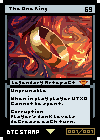

# Series 1

[Book of Stamp](broken-reference)

* [Home](broken-reference)
* [Submit](broken-reference)
* [Rules](broken-reference)
* [How it works](broken-reference)
* [Open Book](broken-reference)

* [A4515906628890571300](https://stampchain.io/asset.html?asset=A4515906628890571300)
* Stamp #: 73996
* Page: 1
* Issuance: 757
* By: Viva la Vandal

* [A6616193069324940000](https://stampchain.io/asset.html?asset=A6616193069324940000)
* Stamp #:
* Page: 2
* Issuance: 100
* By: Viva La Vandal

* [A13336660628198778834](https://stampchain.io/asset.html?asset=A13336660628198778834)
* Stamp #: 74515
* Page: 3
* Issuance: 93
* By: Mikeinspace

* [A8008135800813580085](https://stampchain.io/asset.html?asset=A8008135800813580085)
* Stamp #: 432
* Page: 4
* Issuance: 21
* By: Alth0tas & Regan

* [A999666696969999669](https://stampchain.io/asset.html?asset=A999666696969999669)
* Stamp #: 74327
* Page: 5
* Issuance: 50
* By: Alth0tas

* [A161519201311215145](https://stampchain.io/asset.html?asset=A161519201311215145)
* Stamp #: 74480
* Page: 6
* Issuance: 1
* By: Alth0tas

* [A5433937813514022010](https://stampchain.io/asset.html?asset=A5433937813514022010)
* Stamp #: 11
* Page: 7
* Issuance: 300
* By: Boo & Arwyn

* [A12066123729716648000](https://stampchain.io/asset.html?asset=A12066123729716648000)
* Stamp #: 155
* Page: 8
* Issuance: 50
* By: Stamp Chain

* [A13083972509419815665](https://stampchain.io/asset.html?asset=A13083972509419815665)
* Stamp #: 18529
* Page: 9
* Issuance: 100
* By: Yotet

* [A9480446945963210000](https://stampchain.io/asset.html?asset=A9480446945963210000)
* Stamp #: 74435
* Page: 10
* Issuance: 44
* By: Kero

* [A12301588492677696204](https://stampchain.io/asset.html?asset=A12301588492677696204)
* Stamp #: 74256
* Page: 11
* Issuance: 97
* By: HNFTPepe

* [A8802628178026515559](https://stampchain.io/asset.html?asset=A8802628178026515559)
* Stamp #: 74436
* Page: 12
* Issuance: 45
* By: JuanG

* [A4328048866937698291](https://stampchain.io/asset.html?asset=A4328048866937698291)
* Stamp #: 74312
* Page: 13
* Issuance: 83
* By: Pifu

* [A5555554045555555555](https://stampchain.io/asset.html?asset=A5555554045555555555)
* Stamp #: 74469
* Page: 14
* Issuance: 99
* By: bblieztz

* [A9494624877119506000](https://stampchain.io/asset.html?asset=A9494624877119506000)
* Stamp #: 73990
* Page: 15
* Issuance: 21
* By: Jamex

* [A6449498850632000461](https://stampchain.io/asset.html?asset=A6449498850632000461)
* Stamp #: 74558
* Page: 16
* Issuance: 96
* By: HNFTPepe

* [A17023663791149332840](https://stampchain.io/asset.html?asset=A17023663791149332840)
* Stamp #: 74461
* Page: 17
* Issuance: 63
* By: Normancomics

* [A1234000000000000005](https://stampchain.io/asset.html?asset=A1234000000000000005)
* Stamp #: 428
* Page: 18
* Issuance: 9
* By: FWD

* [A7940572578550479806](https://stampchain.io/asset.html?asset=A7940572578550479806)
* Stamp #: 74437
* Page: 19
* Issuance: 97
* By: degenx

* [A1418950274672556056](https://stampchain.io/asset.html?asset=A1418950274672556056)
* Stamp #: 74732
* Page: 20
* Issuance: 69
* By: hunt
* [A14099796742918991159](https://stampchain.io/asset.html?asset=A14099796742918991159)
* Stamp #: 55443
* Page: 21
* Issuance: 21
* By: lu
